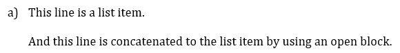

= Metanorma conversion guide

This guide presents recommendations, tips, and FAQ to help in the process of converting Word and PDF document format to Metanorma AsciiDoc. It is assumed though, that the reader is already familiar with the Metanorma AsciiDoc markup described in the link:https://www.metanorma.com/author/[official documentation].

== Overall process

The overall process of converting Word/PDF documents to Metanorma can be summarized in these following steps:

. Take a text editor of your choice, and create a new .adoc file.
. Transfer the raw content from the PDF/DOCX file to the .adoc file.
. Apply proper AsciiDoc/Metanorma markup.
. Compile the .adoc file and check the results.

Simple, right? Well, yes, these are simple steps, especially for short documents. However, things tend to get quite tedious for longer ones. In order to speed up the process, let's start with some recommendations.

== Recommendations

=== Pick a good code editor

Although it is possible to use any plain text editor to edit .adoc files, it is recommended to pick a respected code editor instead, enriched with a good search-and-replace engine and capable of using regular expressions. Some popular ones are: _Notepad++, Atom, Sublime text, VSCode_, among others.

=== Extract the raw content properly

It might seem that raw content can be easily extracted from PDF and Word documents by selecting the text, copying it and pasting into the new .adoc file. But what about the older PDFs, which don't enable text selection?

In most cases, it is easier to extract raw content from PDF documents by using some PDF-to-text online tool. Many free online tools provide the option of text extraction by applying OCR (Optical Character Recognition), which also solves the issue of text extraction from scanned documents, or older PDFs.

When it comes to Word documents, we have some good news - instead of copying raw text, content can be automatically converted to AsciiDoc format using Ruby gem https://github.com/metanorma/reverse_adoc[reverse_adoc]. This gem enables converting even some markup elements, such as text in italic, table markup, etc. Moreover, it extracts images to the separate directory, making it easier for later usage. In this case, you only need to check whether proper markup is applied throughout the document, and make corrections where needed.

=== Use regular expressions

Imagine that you need to convert a document of 100 pages full of sections and subsections. And after transferring all the raw content to the .adoc file, you decide to go through every section/subsection line making changes like "_3.5.6 Some Title_" to "_==== Some Title_", then "_3.5.7 Another Title_" to "_==== Another Title_", and then the next line, and the next one, and argh... Boring, tedious, tiresome, time-consuming, monotonous, uninspiring, God help me! And that is just naming a case from a bunch! So, for this reason and many others, it is better to use _regular expressions_. 

Regular expression, or shorter _regex_, is a sequence of characters used to define a search pattern. It is commonly integrated in the search-and-replace engine of code editors and is easy to learn. With this link:https://www.rexegg.com/regex-quickstart.html[Cheat Sheet], you could get on track quickly. But, without ignoring other options in the web.

In the exposed situation, with regex, you would just open the search-and-replace engine, activate regex mode, look for matches to the following pattern: "^\d+\.\d+\.\d+ (.+)$", replace them all with: "==== $1", and you're done.

Working with regex will save you a lot of time, specially when it comes to converting long documents.

=== Use AsciiDoc live preview for quick markup checking

One of the reasons we recommend to pick up a good code editor is because of the resources it can offer. For instance, many editors give you the option to download _extensions_ to add functionalities like syntax highlighting and _live preview_.

Sooner or later, you'll have to deal with things like encoding complex tables, equations, nested lists, and similar. It can be time-consuming to compile your .adoc more than once just to check if the markup you wrote is correct. For that purpose, you can check out the output quickly by using an AsciiDoc live preview provided by some extension offered by your editor.

== Tips

The following tips complement the information exposed in this section: link:https://www.metanorma.com/author/ref/asciidoc-tips/[Metanorma AsciiDoc tips]

=== Always use lowercase image filenames

If you:

. have a file named `image.PNG` and
. use this line: `image::image.png[]` to include it,

it will work on macOS and Windows, but will fail on Linux!

Linux uses case-sensitive file systems, i.e. `image.PNG` and `image.png` are different file names
and Metanorma will fail to find the specified `image.png`.

If you are on Windows, and have a bunch of filenames ending in .PNG, there is a straightforward way to change them all at once:

1. Go to the folder where the images are located.
2. Place the cursor in the bar address, write "cmd" and press ENTER. The command line will open on that folder location.
3. In the command line, execute the command `ren *.PNG *.png`, and that's it!

=== AsciiMath vs. LaTeX math

Math expressions can be written in AsciiMath or LaTeX math format, which is enabled by `:stem:` document attribute. Default option can be changed from AsciiMath to LaTeX math by using `:stem: latexmath`.

It is recommended to use AsciiMath whenever it is possible, especially since the most of the math expressions can be represented this way. However, some special characters require the help of LaTeX math. Examples of such characters are `\backepsilon` (∍) and `\mathbb{E}` (𝔼). 

In case you are not sure whether the written expression is correct and whether it would render well in either AsciiMath or LaTeX math, you can use https://www.mathjax.org/#demo[MathJax Demo] tool to check the output.

=== Math arrays

Do not use the `eqnarray` environment for arrays since it is not supported by `latexmlmath`.

If you want to know if an equation will pass, try this:

`math.lxml`
[source,latex]
----
V = \frac{1}{2} \: {\bf u}^t \:
            \int_{surface} \: {B'}^t \: D' \: B' \: ds
               \; {\bf u}
----

Run:

[source,sh]
----
cat math.lxml | latexmlmath -
----

=== Tables

Each table cell can be formatted separately by prefixing it with corresponding markup elements. But would you really do it if there is some pattern?

In most cases, alignment of the content in one column remains the same for all column cells. _Specifiers_ can help sparing some time by setting alignment per column, rather per cell. They can also contain information about style, or include some special options, such as adding header, footer, setting auto-width, and similar.

Following example illustrates the usage of _specifier_, which left-aligns the first column and prefixes all its cells with `a` to indicate their content should be interpreted as an AsciiDoc content. It horizontally centers the second column and right-aligns the third one, while adding a header option. 

[source,asciidoc]
----
[cols="<a,^,>",options="header"]
|===
| Column 1 | Column 2 | Column 3

| left aligned | centered | right aligned
|===
----

NOTE: Header should always be separated from the rest of the table content by a blank line, in order to properly render long tables, whose header should be repeated at each new page.

=== Unnumbering elements

The attribute `%unnumbered` is used to remove the numbering from elements like: equation blocks, figures, tables, notes, examples, and code blocks. However, it cannot be used for sections and subsections.

[source,asciidoctor]
.Example of unnumbering elements
----
//Unnumbered image
[%unnumbered]
.Caption image
image::filename.png[]

//Unnumbered table
.Caption table
[%unnumbered]
|===
| This | is 
| a | table
|===

//Unnumbered equation
[stem%unnumbered]
++++
y = x^2
++++
----

=== Removing title from sections and subsections

In case some section or subsection needs to be unnumbered and untitled, you can use `\{blank}` attribute to achieve that.

[source,asciidoctor]
.Example of using `\{blank}` attribute
----
//Blank section
== {blank}
Text

//Blank subsection
=== {blank}
Text
----

=== Escaping characters

Like in normal AsciiDoc, you can escape special characters by prefixing the backslash (`\`) character to the character you want to escape. But, until certain point. There are some cases where this approach will not work. For instance, if you wanted to render a double hyphen `--` instead of an em-dash `—`, you wouldn't be able to do it with `\--` (like in normal Asciidoc). Instead of that, you could use the _Zero Width Non Joiner_ entity `\&#x200c;`, applied like this: `-\&#x200c;-`, which would result in `--`. 

In general terms, you can try escaping by using backslash first, and if that doesn't happen to work, use `\&#x200c;` instead.

== FAQ

=== How can I nest additional content to a list item?

This is a recurrent situation indeed, and it can be handled by using open blocks:

[source,asciidoctor]
----
--
This is an open block
--
----

Which, along with the concatenation character `+`, can be used in the following form:

[source,asciidoctor]
.List item with block concatenation
----
. This line is a list item.
+
--
And this line is concatenated to the list item by using an open block.
--
----

.Result: List item with block concatenation

You can basically put any markup into the concatenated open block: paragraphs, notes, examples, tables, lists, etc.

=== How can I nest additional elements in a table?

If you were wondering whether nesting elements in a table is allowed, the answer is yes. Figures, sourcecodes, math expressions and item lists can be added to a table. Cell which needs to contain such a content has to be prefixed with an `a`, so the processor can interpret it as AsciiDoc content.

The example of nesting a figure and an item list in a table is shown below. Other additional elements can be nested analogously.

[source,asciidoc]
----
|===
//Nesting an unnumbered figure
a| [%unnumbered]
image::image01.png[]

//Nesting an item list
a| Some text

* item 1
* item 2
|===
----

NOTE: When nesting an item list in a table cell, one blank line needs to be present before the first asterisk (`*`) or dot (`.`) used as an indicator for the first item on a list.

=== Why sometimes I get extremely wide tables in DOC output?

This happens because there is one or more cells containing long string characters that make the table wide beyond the borders of the page. In that case, you would need to include the `:break-up-urls-in-tables:` attribute in the preamble in order to divide in lines any long string characters, and thus, shrink the table.

